# Game-Buddy-Backend

## Links

### Website Link --> https://game-buddy-jnb.netlify.app/
### Youtube Link --> https://youtu.be/GFkh3bx-EFU
### Full Github Link --> https://github.com/Jayshil-n-b/game-buddy-jnb-microsoft
### Frontend Github Link --> https://github.com/Jayshil-n-b/gamebuddy-frontend
### Backend Github Link --> https://github.com/Jayshil-n-b/game-buddy-backend

## Important ⚠️⚠️

### Please Allow 15-20 seconds at login time because heroku sleeps after 30 minutes of inactivity and takes about 15-20 seconds to start its services.

# Test Account

- If for some reason username and password given in submission form doesn't work.

### Username: test

### Password: 123

- You can also create your own account on site. Its easy.

# Algorithm

- Content Based Filtering using KNN Algorithm.
- Have used Cosine Similarity to generate recommendations.
- After processing, website contains nearly 5400 games.
- Sort basis of cosine angle and on basis of number of owners of particular game has been taken in use.

# User Management

1. Register Page (On Register Redirects to login page).

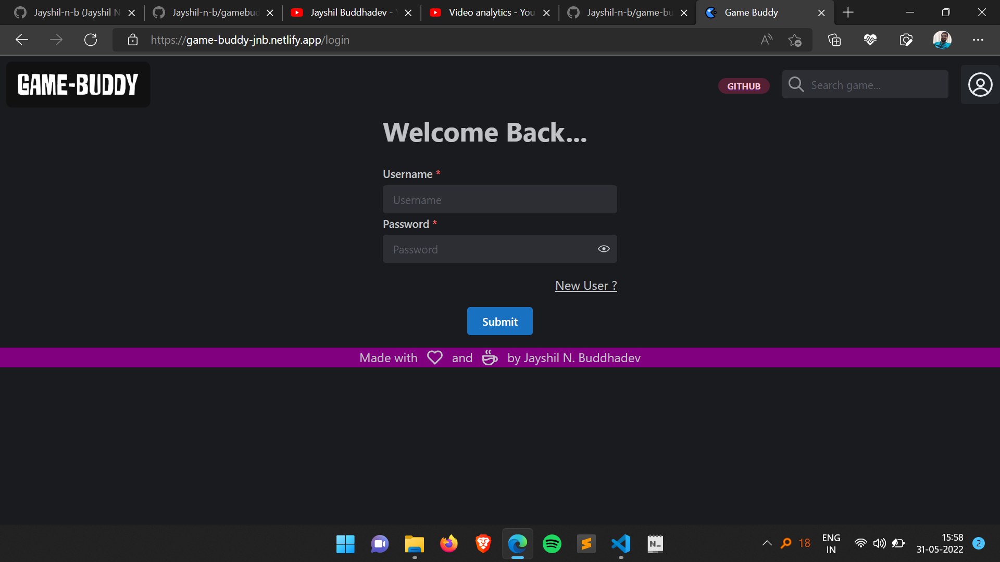

2. Login Page (On Login Gets to homepage)
   1. Takes 3 genres that user is interested in.

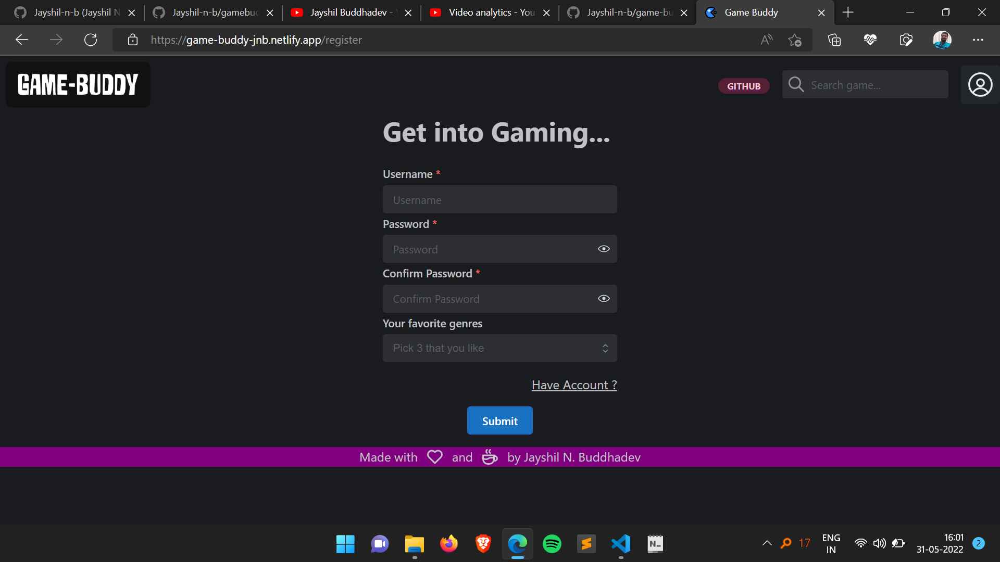

---

# Home Page

- Top Carousel

  - Continue playing last game (If user has history).
  - Top games (Based on popularity) in chosen 3 genres at registration time.

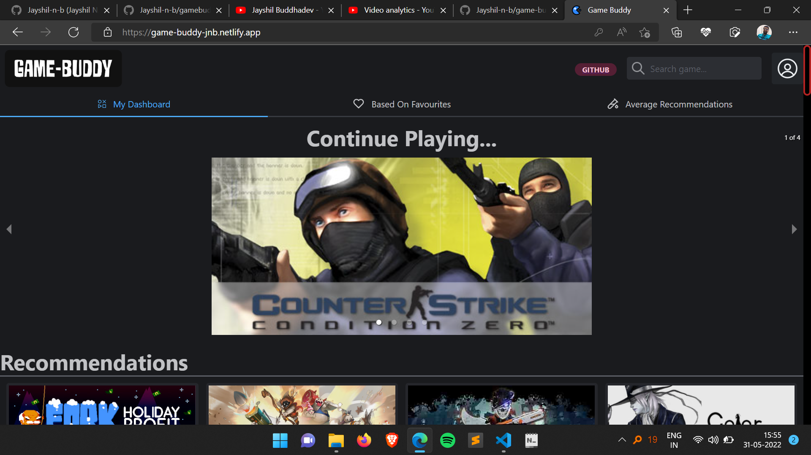

- Recommendations

  - Based on play times of games generate recommendations and show them. (100 Recommendations). Randomizing order to allow user to discover new games fast.

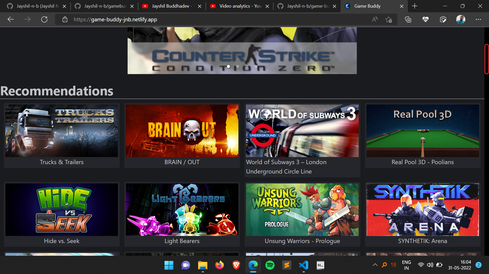

- Based On Favorite

  - Recommend games on basis of favorites marked by user all in equal proportion and in random order.

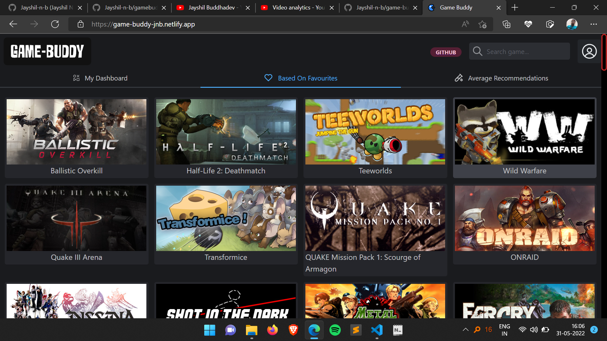

- Average Recommendations
  - Recommendations are generated on the basis of weighted average of past played games (using game and its play time) and shown to the user.

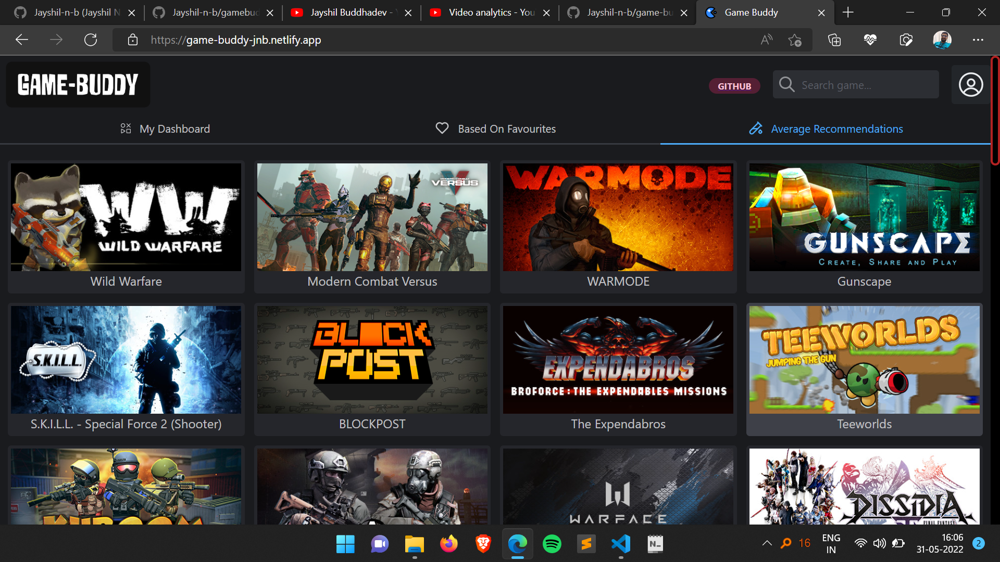

# Header (Navbar)

- Shows website logo (on click goes to home page if user is logged in else goes to login page).

- Search Bar to search games.

- User Profile Avatar (if user is login) else login button.

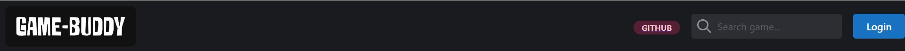

- User Menu (Opens when click on user Avatar)
  - Account option to go to user account.
  - Logout option to logout and go to login page.

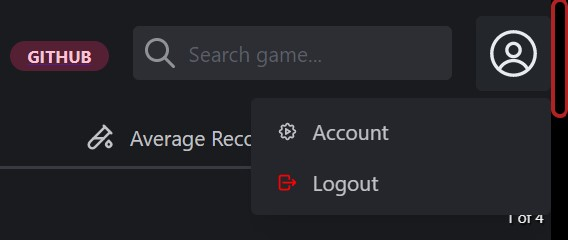

# Game Page

- Contains information and actions user can do on game.
  - Can be added to favorite (Only available if user is logged in)
  - Can play game using Play button (Only available if user is logged in)

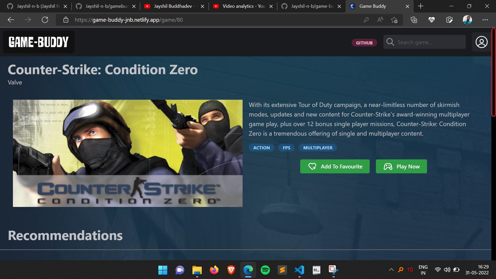

- Play game button opens a modal where user is supposed to play game.
  - It contains a button which can add 10 minute to play time.

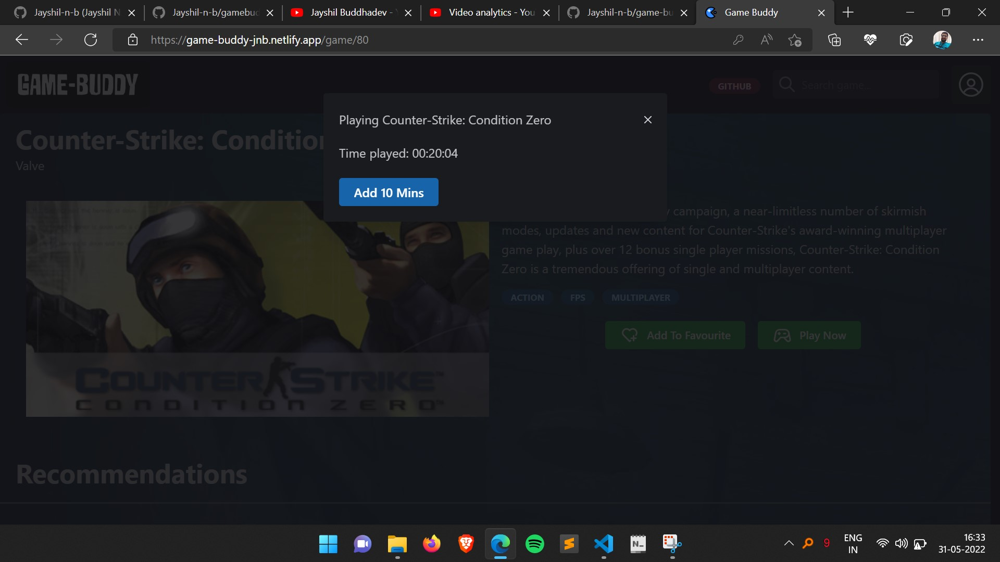

- Play time and favorite button interactions are sent to mongodb database via flask server and stored into it.

# User Page

- It has user profile section where user can view its username and genres which he/she has selected at the time of registration.

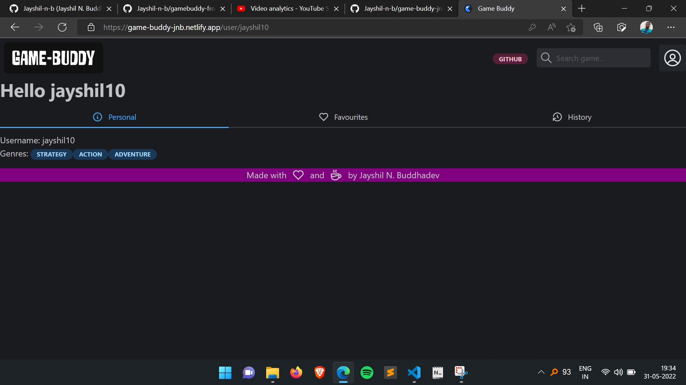

- It has favorite tab which shows all the games which are/will be marked by user.

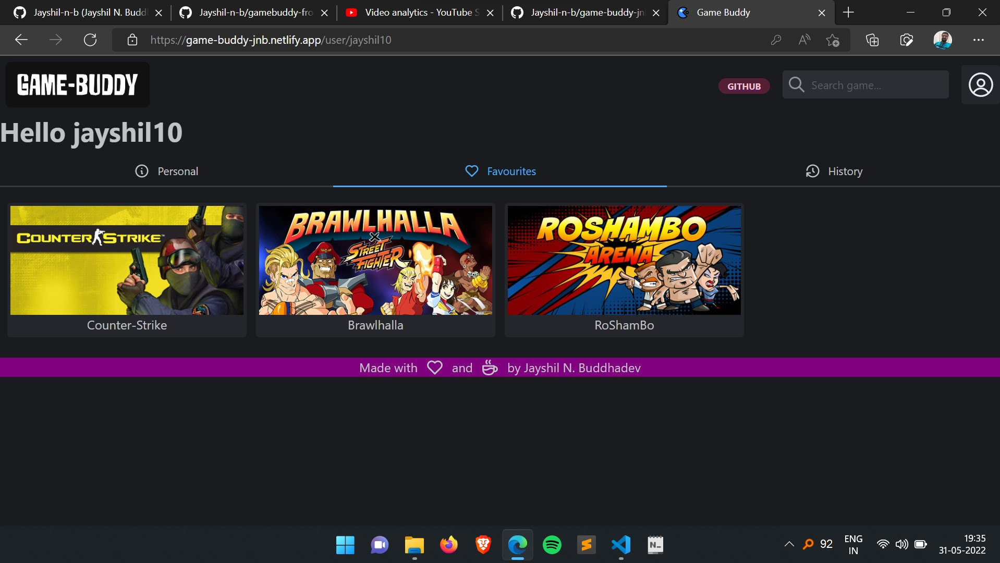

- It has History section where history of game play time will be shown. So user can keep track on what game it plays and what duration it has played that game.

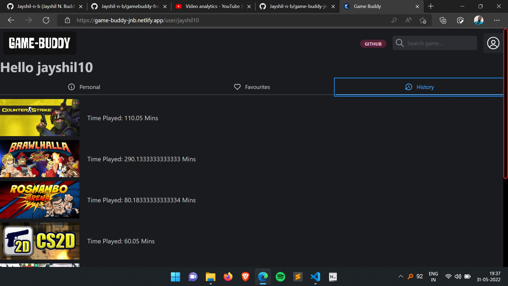
